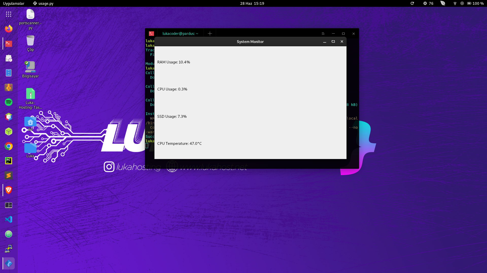

# system-monitor
System Monitor, gerçek zamanlı olarak sistem izleme bilgilerini görsel olarak sunan bir Python uygulamasıdır. RAM kullanımı, işlemci kullanımı, SSD kullanımı ve işlemci sıcaklığı gibi sistem istatistiklerini anlık olarak görüntüleyebilir.
# System Monitor

This is a Python application that uses Qt to display real-time system monitoring information, including RAM usage, CPU usage, SSD usage, and CPU temperature.



## Requirements

- Python 3.x
- PyQt5
- psutil

## Installation

1. Clone the repository:

   ```bash
   git clone https://github.com/lukacoder/system-monitor.git

pip install -r requirements.txt

Usage
Run the usage.py script:

bash
python usage.py
